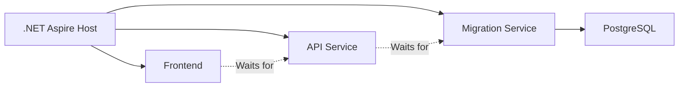
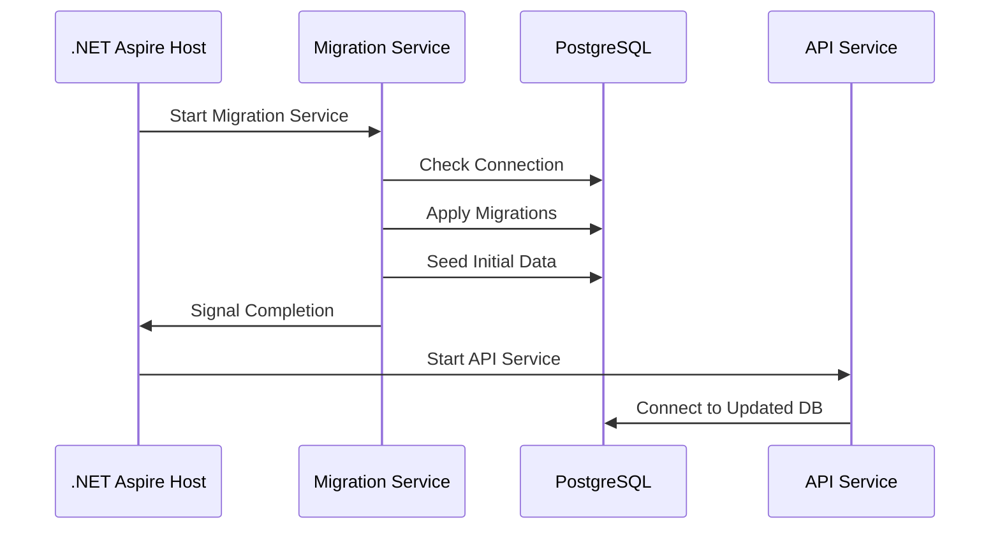

# ChapLog - マイグレーションサービス設計書

## 1. 概要

ChapLog.MigrationService は、.NET Aspire アプリケーションにおいてデータベースマイグレーションを管理する専用のWorker Serviceです。Entity Framework Core のマイグレーション機能を活用し、アプリケーション起動前に自動的にデータベーススキーマを更新します。

## 2. アーキテクチャ

### 2.1 サービスの位置づけ



### 2.2 実行フロー



## 3. 実装詳細

### 3.1 プロジェクト構成

```
ChapLog.MigrationService/
├── ChapLog.MigrationService.csproj
├── Program.cs
├── Worker.cs
├── DataSeeder.cs
├── appsettings.json
└── appsettings.Development.json
```

### 3.2 ChapLog.MigrationService.csproj

```xml
<Project Sdk="Microsoft.NET.Sdk.Worker">

  <PropertyGroup>
    <TargetFramework>net9.0</TargetFramework>
    <Nullable>enable</Nullable>
    <ImplicitUsings>enable</ImplicitUsings>
  </PropertyGroup>

  <ItemGroup>
    <PackageReference Include="Microsoft.Extensions.Hosting" Version="9.0.0" />
    <PackageReference Include="Microsoft.EntityFrameworkCore.Design" Version="9.0.0">
      <PrivateAssets>all</PrivateAssets>
      <IncludeAssets>runtime; build; native; contentfiles; analyzers; buildtransitive</IncludeAssets>
    </PackageReference>
  </ItemGroup>

  <ItemGroup>
    <ProjectReference Include="..\ChapLog.Infrastructure\ChapLog.Infrastructure.csproj" />
    <ProjectReference Include="..\ChapLog.ServiceDefaults\ChapLog.ServiceDefaults.csproj" />
  </ItemGroup>

</Project>
```

### 3.3 Program.cs

```csharp
using ChapLog.Infrastructure.Data;
using ChapLog.MigrationService;

var builder = Host.CreateApplicationBuilder(args);

// .NET Aspire サービスデフォルトの追加
builder.AddServiceDefaults();

// PostgreSQL DbContext の追加
builder.AddNpgsqlDbContext<ChapLogDbContext>("chaplogdb", settings =>
{
    settings.DisableRetry = false;
    settings.CommandTimeout = 60;
});

// データシーダーサービスの追加
builder.Services.AddTransient<DataSeeder>();

// Worker サービスの追加
builder.Services.AddHostedService<Worker>();

// ログの設定
builder.Services.AddLogging(logging =>
{
    logging.AddConsole();
    logging.SetMinimumLevel(LogLevel.Information);
});

var host = builder.Build();
host.Run();
```

### 3.4 Worker.cs

```csharp
using ChapLog.Infrastructure.Data;
using Microsoft.EntityFrameworkCore;
using Microsoft.EntityFrameworkCore.Infrastructure;
using Microsoft.EntityFrameworkCore.Storage;
using Npgsql;

namespace ChapLog.MigrationService;

public class Worker(
    IServiceProvider serviceProvider,
    IHostApplicationLifetime hostApplicationLifetime,
    ILogger<Worker> logger) : BackgroundService
{
    protected override async Task ExecuteAsync(CancellationToken stoppingToken)
    {
        try
        {
            using var scope = serviceProvider.CreateScope();
            var dbContext = scope.ServiceProvider.GetRequiredService<ChapLogDbContext>();
            var dataSeeder = scope.ServiceProvider.GetRequiredService<DataSeeder>();

            // データベース接続の待機
            await WaitForDatabaseAsync(dbContext, stoppingToken);

            // マイグレーション実行
            await MigrateAsync(dbContext, stoppingToken);

            // 初期データのシーディング
            await dataSeeder.SeedAsync(dbContext, stoppingToken);

            logger.LogInformation("Migration service completed successfully");
        }
        catch (Exception ex)
        {
            logger.LogError(ex, "An error occurred during migration");
            throw;
        }
        finally
        {
            // サービスを停止
            hostApplicationLifetime.StopApplication();
        }
    }

    private async Task WaitForDatabaseAsync(ChapLogDbContext dbContext, CancellationToken cancellationToken)
    {
        var maxRetries = 10;
        var delay = TimeSpan.FromSeconds(5);

        for (var i = 0; i < maxRetries; i++)
        {
            try
            {
                logger.LogInformation("Attempting to connect to database...");
                
                await dbContext.Database.CanConnectAsync(cancellationToken);
                
                logger.LogInformation("Successfully connected to database");
                return;
            }
            catch (NpgsqlException ex)
            {
                logger.LogWarning(ex, "Failed to connect to database. Attempt {Attempt} of {MaxRetries}", i + 1, maxRetries);
                
                if (i < maxRetries - 1)
                {
                    await Task.Delay(delay, cancellationToken);
                }
            }
        }

        throw new InvalidOperationException($"Could not connect to database after {maxRetries} attempts");
    }

    private async Task MigrateAsync(ChapLogDbContext dbContext, CancellationToken cancellationToken)
    {
        logger.LogInformation("Starting database migration...");

        var strategy = dbContext.Database.CreateExecutionStrategy();
        
        await strategy.ExecuteAsync(async () =>
        {
            // 保留中のマイグレーションを取得
            var pendingMigrations = await dbContext.Database.GetPendingMigrationsAsync(cancellationToken);
            
            if (pendingMigrations.Any())
            {
                logger.LogInformation("Found {Count} pending migrations", pendingMigrations.Count());
                
                foreach (var migration in pendingMigrations)
                {
                    logger.LogInformation("Pending migration: {Migration}", migration);
                }

                // マイグレーション実行
                await dbContext.Database.MigrateAsync(cancellationToken);
                
                logger.LogInformation("Database migration completed successfully");
            }
            else
            {
                logger.LogInformation("No pending migrations found");
            }
        });
    }
}
```

### 3.5 DataSeeder.cs

```csharp
using ChapLog.Core.Entities;
using ChapLog.Infrastructure.Data;
using Microsoft.AspNetCore.Identity;
using Microsoft.EntityFrameworkCore;

namespace ChapLog.MigrationService;

public class DataSeeder(ILogger<DataSeeder> logger)
{
    public async Task SeedAsync(ChapLogDbContext context, CancellationToken cancellationToken)
    {
        logger.LogInformation("Starting data seeding...");

        try
        {
            await SeedAdminUserAsync(context, cancellationToken);
            await SeedSampleDataAsync(context, cancellationToken);
            
            logger.LogInformation("Data seeding completed successfully");
        }
        catch (Exception ex)
        {
            logger.LogError(ex, "An error occurred during data seeding");
            throw;
        }
    }

    private async Task SeedAdminUserAsync(ChapLogDbContext context, CancellationToken cancellationToken)
    {
        // 管理者ユーザーが存在しない場合のみ作成
        if (!await context.Users.AnyAsync(u => u.Role == "Admin", cancellationToken))
        {
            logger.LogInformation("Creating admin user...");

            var hasher = new PasswordHasher<User>();
            var adminUser = new User
            {
                Id = Guid.NewGuid(),
                Email = "admin@chaplog.local",
                NormalizedEmail = "ADMIN@CHAPLOG.LOCAL",
                UserName = "Administrator",
                NormalizedUserName = "ADMINISTRATOR",
                EmailConfirmed = true,
                LockoutEnabled = false,
                SecurityStamp = Guid.NewGuid().ToString(),
                ConcurrencyStamp = Guid.NewGuid().ToString(),
                Role = "Admin",
                CreatedAt = DateTime.UtcNow,
                UpdatedAt = DateTime.UtcNow
            };

            // パスワードのハッシュ化
            adminUser.PasswordHash = hasher.HashPassword(adminUser, "Admin123!");

            context.Users.Add(adminUser);
            await context.SaveChangesAsync(cancellationToken);
            
            logger.LogInformation("Admin user created successfully");
        }
    }

    private async Task SeedSampleDataAsync(ChapLogDbContext context, CancellationToken cancellationToken)
    {
        // 開発環境でのみサンプルデータを作成
        var environment = Environment.GetEnvironmentVariable("ASPNETCORE_ENVIRONMENT");
        if (environment != "Development")
        {
            return;
        }

        // サンプルデータが存在しない場合のみ作成
        if (await context.Books.AnyAsync(cancellationToken))
        {
            return;
        }

        logger.LogInformation("Creating sample data for development environment...");

        var sampleUser = await context.Users.FirstOrDefaultAsync(u => u.Email == "admin@chaplog.local", cancellationToken);
        if (sampleUser == null)
        {
            return;
        }

        // サンプル書籍データ
        var sampleBooks = new[]
        {
            new Book
            {
                Id = Guid.NewGuid(),
                UserId = sampleUser.Id,
                Title = "プログラミングの心理学",
                Author = "ジェラルド・M・ワインバーグ",
                Publisher = "技術評論社",
                PublicationYear = 2020,
                TotalPages = 320,
                Genre = "技術書",
                Status = "completed",
                Notes = "プログラミングにおける人間的側面についての古典的名著",
                CurrentPage = 320,
                StartedAt = DateTime.UtcNow.AddDays(-30),
                CompletedAt = DateTime.UtcNow.AddDays(-5),
                CreatedAt = DateTime.UtcNow.AddDays(-35),
                UpdatedAt = DateTime.UtcNow
            },
            new Book
            {
                Id = Guid.NewGuid(),
                UserId = sampleUser.Id,
                Title = "リーダブルコード",
                Author = "Dustin Boswell、Trevor Foucher",
                Publisher = "オライリージャパン",
                PublicationYear = 2012,
                TotalPages = 260,
                Genre = "技術書",
                Status = "reading",
                Notes = "より良いコードを書くためのシンプルで実践的なテクニック",
                CurrentPage = 120,
                StartedAt = DateTime.UtcNow.AddDays(-10),
                CreatedAt = DateTime.UtcNow.AddDays(-15),
                UpdatedAt = DateTime.UtcNow
            }
        };

        context.Books.AddRange(sampleBooks);
        await context.SaveChangesAsync(cancellationToken);
        
        logger.LogInformation("Sample data created successfully");
    }
}
```

### 3.6 appsettings.json

```json
{
  "Logging": {
    "LogLevel": {
      "Default": "Information",
      "Microsoft.Hosting.Lifetime": "Information",
      "Microsoft.EntityFrameworkCore": "Warning"
    }
  }
}
```

## 4. .NET Aspire ホストでの設定

### 4.1 AppHost/Program.cs での設定

```csharp
var builder = DistributedApplication.CreateBuilder(args);

// PostgreSQL設定
var postgres = builder.AddPostgres("postgres")
    .WithPgAdmin()
    .AddDatabase("chaplogdb");

// Seq設定（ログ管理）
var seq = builder.AddSeq("seq");

// マイグレーションサービス
var migrationService = builder.AddProject<Projects.ChapLog_MigrationService>("migration")
    .WithReference(postgres)
    .WithReference(seq)
    .WithEnvironment("ASPNETCORE_ENVIRONMENT", builder.Environment.EnvironmentName);

// API設定（マイグレーション完了を待つ）
var api = builder.AddProject<Projects.ChapLog_Api>("api")
    .WithReference(postgres)
    .WithReference(seq)
    .WaitFor(migrationService);

builder.Build().Run();
```

## 5. エラーハンドリングとリトライ戦略

### 5.1 接続リトライ
- データベースが起動するまで最大10回リトライ
- 各リトライ間隔は5秒

### 5.2 マイグレーション実行戦略
- Entity Framework Core の実行戦略を使用
- 一時的なエラーに対する自動リトライ

### 5.3 ログ記録
- すべての重要な操作をログに記録
- エラー発生時の詳細情報を保存

## 6. セキュリティ考慮事項

### 6.1 接続文字列の管理
- 環境変数または.NET Aspireの設定から取得
- ハードコードされた認証情報は使用しない

### 6.2 初期パスワード
- 管理者の初期パスワードは環境変数から取得
- 本番環境では強力なパスワードを設定

## 7. 運用上の考慮事項

### 7.1 マイグレーション履歴
- __EFMigrationsHistory テーブルで管理
- 適用済みマイグレーションの追跡

### 7.2 ロールバック対応
- ダウンマイグレーションのサポート
- バックアップとリストア手順の整備

### 7.3 パフォーマンス
- 大規模なスキーマ変更は営業時間外に実施
- インデックス作成の影響を考慮

## 8. 開発ワークフロー

### 8.1 新しいマイグレーションの追加
```bash
# Infrastructure プロジェクトでマイグレーションを作成
dotnet ef migrations add NewFeature -p ChapLog.Infrastructure -s ChapLog.Api
```

### 8.2 ローカル開発での実行
```bash
# .NET Aspire ホストを実行（マイグレーションサービスが自動実行）
dotnet run --project ChapLog.AppHost
```

### 8.3 本番環境への適用
- CI/CDパイプラインでマイグレーションサービスを実行
- Blue-Greenデプロイメントでの安全な更新