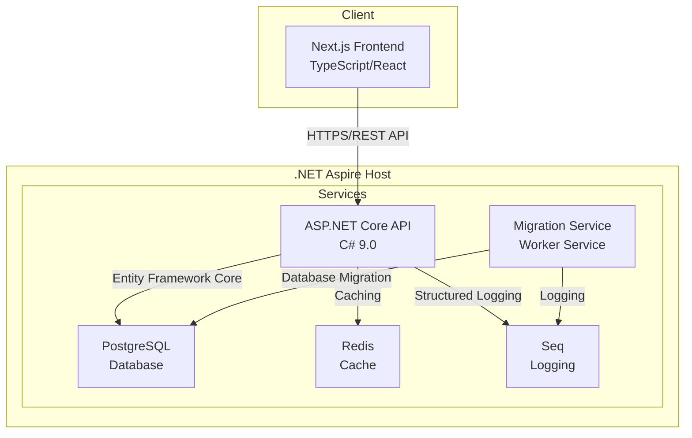
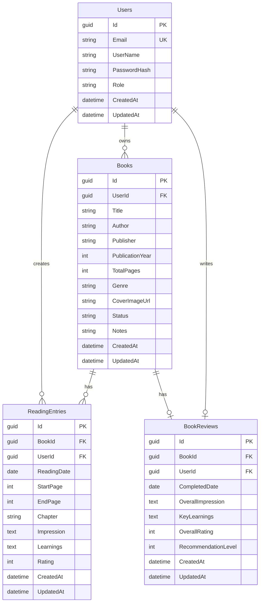

# ChapLog - システム設計書

## 1. システムアーキテクチャ

### 1.1 全体構成



### 1.2 コンテナ構成

```yaml
# .NET Aspire によるサービス構成
Services:
  - chaplog-frontend (Next.js)
  - chaplog-api (ASP.NET Core)
  - chaplog-migration (Migration Worker Service)
  - chaplog-db (PostgreSQL)
  - chaplog-cache (Redis)
  - chaplog-logs (Seq)
```

## 2. フロントエンド設計

### 2.1 技術スタック
- **Framework**: Next.js 15 (App Router)
- **Language**: TypeScript 5.x
- **State Management**: Zustand
- **UI Library**: Tailwind CSS + shadcn/ui
- **HTTP Client**: Axios
- **Form Handling**: React Hook Form + Zod
- **認証**: NextAuth.js

### 2.2 ディレクトリ構造

```
chaplog-frontend/
├── app/
│   ├── (auth)/
│   │   ├── login/
│   │   └── register/
│   ├── (main)/
│   │   ├── books/
│   │   │   ├── [id]/
│   │   │   │   ├── page.tsx
│   │   │   │   └── entries/
│   │   │   └── page.tsx
│   │   ├── dashboard/
│   │   └── statistics/
│   └── layout.tsx
├── components/
│   ├── ui/
│   ├── books/
│   └── common/
├── lib/
│   ├── api/
│   └── utils/
└── stores/
```

### 2.3 主要コンポーネント

#### 2.3.1 認証関連
- LoginForm: ログインフォーム
- RegisterForm: ユーザー登録フォーム
- AuthProvider: 認証コンテキスト

#### 2.3.2 書籍管理
- BookList: 書籍一覧
- BookCard: 書籍カード
- BookForm: 書籍登録・編集フォーム
- BookDetail: 書籍詳細

#### 2.3.3 読書日記
- EntryForm: 日記作成フォーム
- EntryList: 日記一覧
- EntryDetail: 日記詳細

#### 2.3.4 統計
- ReadingChart: 読書統計グラフ
- StatsDashboard: 統計ダッシュボード

## 3. バックエンド設計

### 3.1 技術スタック
- **Framework**: ASP.NET Core 9.0
- **Language**: C# 13
- **ORM**: Entity Framework Core 9
- **認証**: ASP.NET Core Identity
- **API Documentation**: Swagger/OpenAPI
- **Validation**: FluentValidation
- **Mapping**: AutoMapper

### 3.2 プロジェクト構造

```
ChapLog/
├── ChapLog.Api/              # Web API プロジェクト
│   ├── Controllers/
│   ├── Program.cs
│   └── appsettings.json
├── ChapLog.Core/             # ドメインモデル・インターフェース
│   ├── Entities/
│   ├── Interfaces/
│   └── DTOs/
├── ChapLog.Infrastructure/   # インフラストラクチャ層
│   ├── Data/
│   │   └── ChapLogDbContext.cs
│   ├── Migrations/
│   ├── Repositories/
│   └── Services/
├── ChapLog.MigrationService/ # データベースマイグレーションサービス
│   ├── Worker.cs
│   ├── Program.cs
│   └── appsettings.json
├── ChapLog.ServiceDefaults/  # 共通サービス設定
│   └── Extensions.cs
├── ChapLog.AppHost/          # .NET Aspire ホスト
│   └── Program.cs
└── ChapLog.Tests/            # テストプロジェクト
    ├── ChapLog.UnitTests/
    │   ├── Services/
    │   ├── Repositories/
    │   └── Utilities/
    ├── ChapLog.IntegrationTests/
    │   ├── ApiTests/
    │   ├── MigrationTests/
    │   └── Infrastructure/
    └── ChapLog.E2ETests/
        ├── Pages/
        └── Infrastructure/
```

### 3.3 レイヤードアーキテクチャ

#### 3.3.1 API層
- RESTful API エンドポイント
- 認証・認可の処理
- リクエスト/レスポンスの変換

#### 3.3.2 ビジネスロジック層
- ドメインサービス
- ビジネスルールの実装
- トランザクション管理

#### 3.3.3 データアクセス層
- Repository パターン
- Entity Framework Core による DB アクセス
- キャッシング戦略

### 3.4 主要エンドポイント

```
# 認証
POST   /api/auth/register
POST   /api/auth/login
POST   /api/auth/logout
POST   /api/auth/refresh

# 書籍管理
GET    /api/books
GET    /api/books/{id}
POST   /api/books
PUT    /api/books/{id}
DELETE /api/books/{id}
PATCH  /api/books/{id}/status

# 読書日記
GET    /api/books/{bookId}/entries
GET    /api/entries/{id}
POST   /api/books/{bookId}/entries
PUT    /api/entries/{id}
DELETE /api/entries/{id}

# レビュー
GET    /api/books/{bookId}/review
POST   /api/books/{bookId}/review
PUT    /api/books/{bookId}/review

# 統計
GET    /api/statistics/summary
GET    /api/statistics/monthly
GET    /api/statistics/genres

# 管理者
GET    /api/admin/users
GET    /api/admin/users/{id}
DELETE /api/admin/users/{id}
```

## 4. データベース設計

### 4.1 ER図



## 5. セキュリティ設計

### 5.1 認証・認可
- JWT Bearer Token による API 認証
- Role-based Authorization (User/Admin)
- Refresh Token による自動更新

### 5.2 データ保護
- パスワードのハッシュ化 (BCrypt)
- HTTPS 必須
- CORS 設定

### 5.3 入力検証
- DTOレベルでの検証
- SQLインジェクション対策 (パラメータクエリ)
- XSS対策 (出力エスケープ)

## 6. インフラストラクチャ設計

### 6.1 .NET Aspire 構成

```csharp
// Program.cs (AppHost)
var builder = DistributedApplication.CreateBuilder(args);

// PostgreSQL設定
var postgres = builder.AddPostgres("postgres")
    .WithPgAdmin()
    .AddDatabase("chaplogdb");

// Redis設定
var redis = builder.AddRedis("redis");

// Seq設定（ログ管理）
var seq = builder.AddSeq("seq");

// マイグレーションサービス
var migrationService = builder.AddProject<Projects.ChapLog_MigrationService>("migration")
    .WithReference(postgres)
    .WithReference(seq);

// API設定
var api = builder.AddProject<Projects.ChapLog_Api>("api")
    .WithReference(postgres)
    .WithReference(redis)
    .WithReference(seq)
    .WaitFor(migrationService); // マイグレーション完了を待つ

// フロントエンド設定
var frontend = builder.AddNpmApp("frontend", "../chaplog-frontend")
    .WithHttpEndpoint(port: 3000, env: "PORT")
    .WithEnvironment("NEXT_PUBLIC_API_URL", api.GetEndpoint("http"))
    .WaitFor(api); // API起動を待つ

builder.Build().Run();
```

### 6.2 マイグレーションサービス設計

#### 6.2.1 概要
- 専用のWorker Serviceとしてデータベースマイグレーションを実行
- アプリケーション起動前に自動的にマイグレーションを適用
- 初期データのシーディングも対応

#### 6.2.2 実装例
```csharp
// Worker.cs (MigrationService)
public class Worker(
    IServiceProvider serviceProvider,
    IHostApplicationLifetime hostApplicationLifetime,
    ILogger<Worker> logger) : BackgroundService
{
    protected override async Task ExecuteAsync(CancellationToken stoppingToken)
    {
        try
        {
            using var scope = serviceProvider.CreateScope();
            var dbContext = scope.ServiceProvider.GetRequiredService<ChapLogDbContext>();

            logger.LogInformation("Starting database migration...");

            // マイグレーション実行
            await dbContext.Database.MigrateAsync(stoppingToken);
            logger.LogInformation("Database migration completed successfully");

            // 初期データのシーディング
            await SeedDataAsync(dbContext, stoppingToken);
            logger.LogInformation("Data seeding completed successfully");
        }
        catch (Exception ex)
        {
            logger.LogError(ex, "An error occurred while migrating the database");
            throw;
        }
        finally
        {
            hostApplicationLifetime.StopApplication();
        }
    }

    private async Task SeedDataAsync(ChapLogDbContext context, CancellationToken cancellationToken)
    {
        // 管理者ユーザーの作成
        if (!await context.Users.AnyAsync(u => u.Role == "Admin", cancellationToken))
        {
            var adminUser = new User
            {
                Email = "admin@chaplog.local",
                UserName = "Administrator",
                Role = "Admin",
                EmailConfirmed = true
            };
            
            context.Users.Add(adminUser);
            await context.SaveChangesAsync(cancellationToken);
        }
    }
}
```

#### 6.2.3 Program.cs (MigrationService)
```csharp
var builder = Host.CreateApplicationBuilder(args);

// サービスデフォルトの追加
builder.AddServiceDefaults();

// DbContext の追加
builder.AddNpgsqlDbContext<ChapLogDbContext>("chaplogdb");

// Worker サービスの追加
builder.Services.AddHostedService<Worker>();

var host = builder.Build();
host.Run();
```

### 6.3 ロギング戦略
- Structured Logging (Serilog)
- ログレベル: Error, Warning, Information, Debug
- Seq による集中ログ管理

### 6.4 キャッシング戦略
- Redis による分散キャッシュ
- キャッシュ対象:
  - ユーザーセッション
  - 頻繁にアクセスされる書籍データ
  - 統計データ (1時間キャッシュ)

## 7. 開発環境セットアップ

### 7.1 必要なツール
- .NET SDK 9.0
- Node.js 20.x
- Docker Desktop
- Visual Studio 2022 / VS Code

### 7.2 環境変数
```env
# API (.env)
ConnectionStrings__DefaultConnection=Host=localhost;Database=chaplogdb;Username=postgres;Password=password
Redis__ConnectionString=localhost:6379
Seq__ServerUrl=http://localhost:5341
JWT__Secret=your-secret-key
JWT__Issuer=chaplog-api
JWT__Audience=chaplog-client

# Frontend (.env.local)
NEXT_PUBLIC_API_URL=http://localhost:5000
NEXTAUTH_URL=http://localhost:3000
NEXTAUTH_SECRET=your-nextauth-secret
```

## 8. デプロイメント

### 8.1 開発環境での実行
```bash
# .NET Aspire でのビルドと実行
dotnet run --project ChapLog.AppHost

# マイグレーションの作成（開発時）
dotnet ef migrations add InitialCreate -p ChapLog.Infrastructure -s ChapLog.Api
```

### 8.2 本番環境考慮事項
- SSL証明書の設定
- データベースバックアップ戦略
- ログローテーション
- モニタリング設定
- マイグレーションサービスの実行管理

### 8.3 テスト実行
```bash
# 全テスト実行
dotnet test

# 単体テストのみ
dotnet test ChapLog.UnitTests

# 結合テストのみ (.NET Aspire使用)
dotnet test ChapLog.IntegrationTests

# E2Eテストのみ
dotnet test ChapLog.E2ETests

# カバレッジ付きテスト
dotnet test --collect:"XPlat Code Coverage"
```

## 9. パフォーマンス最適化

### 9.1 フロントエンド
- 画像の遅延読み込み
- コード分割 (Dynamic Import)
- Service Worker によるキャッシング

### 9.2 バックエンド
- データベースインデックスの最適化
- N+1問題の回避 (Include使用)
- 非同期処理の活用
- Response Compression

### 9.3 データベース
- 適切なインデックス設計
- クエリ最適化
- Connection Pooling