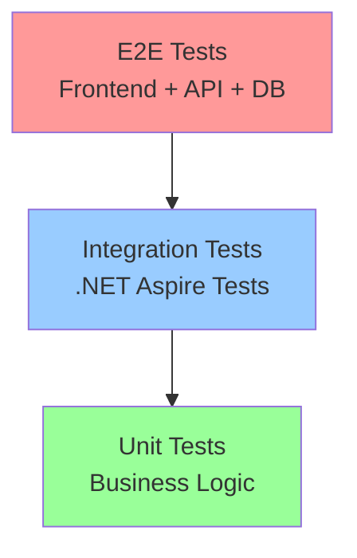

# ChapLog - テスト設計書

## 1. テスト戦略

### 1.1 テストピラミッド



### 1.2 テストの分類

| テストレベル | 目的 | 対象 | フレームワーク |
|-------------|------|------|---------------|
| Unit Tests | ビジネスロジックの単体テスト | Services, Repositories, Utilities | xUnit, Moq |
| Integration Tests | サービス間連携のテスト | API + Database, Migration Service | .NET Aspire Testing, xUnit |
| E2E Tests | システム全体の動作確認 | Frontend + Backend + Database | Playwright, xUnit |

## 2. プロジェクト構成

### 2.1 テストプロジェクト構造

```
ChapLog.Tests/
├── ChapLog.UnitTests/              # 単体テスト
│   ├── ChapLog.UnitTests.csproj
│   ├── Services/
│   │   ├── BookServiceTests.cs
│   │   ├── ReadingEntryServiceTests.cs
│   │   └── StatisticsServiceTests.cs
│   ├── Repositories/
│   │   ├── BookRepositoryTests.cs
│   │   └── UserRepositoryTests.cs
│   └── Utilities/
│       └── PasswordHasherTests.cs
├── ChapLog.IntegrationTests/       # 結合テスト (.NET Aspire)
│   ├── ChapLog.IntegrationTests.csproj
│   ├── ApiTests/
│   │   ├── BookApiTests.cs
│   │   ├── AuthApiTests.cs
│   │   └── StatisticsApiTests.cs
│   ├── MigrationTests/
│   │   └── DatabaseMigrationTests.cs
│   └── Infrastructure/
│       ├── TestWebApplicationFactory.cs
│       └── DatabaseFixture.cs
└── ChapLog.E2ETests/               # E2Eテスト
    ├── ChapLog.E2ETests.csproj
    ├── Pages/
    │   ├── LoginPageTests.cs
    │   ├── BookManagementTests.cs
    │   └── ReadingEntryTests.cs
    └── Infrastructure/
        └── PlaywrightFixture.cs
```

## 3. 単体テスト設計

### 3.1 技術スタック
- **フレームワーク**: xUnit
- **モッキング**: Moq
- **アサーション**: FluentAssertions
- **テストデータ**: AutoFixture

### 3.2 ChapLog.UnitTests.csproj

```xml
<Project Sdk="Microsoft.NET.Sdk">

  <PropertyGroup>
    <TargetFramework>net9.0</TargetFramework>
    <Nullable>enable</Nullable>
    <ImplicitUsings>enable</ImplicitUsings>
    <IsPackable>false</IsPackable>
    <IsTestProject>true</IsTestProject>
  </PropertyGroup>

  <ItemGroup>
    <PackageReference Include="Microsoft.NET.Test.Sdk" Version="17.11.1" />
    <PackageReference Include="xunit" Version="2.9.2" />
    <PackageReference Include="xunit.runner.visualstudio" Version="2.8.2" />
    <PackageReference Include="Moq" Version="4.20.72" />
    <PackageReference Include="FluentAssertions" Version="6.12.1" />
    <PackageReference Include="AutoFixture" Version="4.18.1" />
    <PackageReference Include="AutoFixture.Xunit2" Version="4.18.1" />
    <PackageReference Include="Microsoft.EntityFrameworkCore.InMemory" Version="9.0.0" />
    <PackageReference Include="coverlet.collector" Version="6.0.2" />
  </ItemGroup>

  <ItemGroup>
    <ProjectReference Include="..\..\ChapLog.Core\ChapLog.Core.csproj" />
    <ProjectReference Include="..\..\ChapLog.Infrastructure\ChapLog.Infrastructure.csproj" />
  </ItemGroup>

</Project>
```

### 3.3 単体テストの実装例

#### 3.3.1 BookServiceTests.cs

```csharp
using AutoFixture;
using AutoFixture.Xunit2;
using ChapLog.Core.Entities;
using ChapLog.Core.Interfaces;
using ChapLog.Infrastructure.Services;
using FluentAssertions;
using Moq;

namespace ChapLog.UnitTests.Services;

public class BookServiceTests
{
    private readonly Mock<IBookRepository> _bookRepositoryMock;
    private readonly Mock<IUserRepository> _userRepositoryMock;
    private readonly BookService _bookService;
    private readonly IFixture _fixture;

    public BookServiceTests()
    {
        _bookRepositoryMock = new Mock<IBookRepository>();
        _userRepositoryMock = new Mock<IUserRepository>();
        _bookService = new BookService(_bookRepositoryMock.Object, _userRepositoryMock.Object);
        _fixture = new Fixture();
    }

    [Theory, AutoData]
    public async Task CreateBookAsync_ValidBook_ReturnsCreatedBook(Book book)
    {
        // Arrange
        var userId = Guid.NewGuid();
        book.UserId = userId;
        
        _userRepositoryMock
            .Setup(x => x.ExistsAsync(userId, It.IsAny<CancellationToken>()))
            .ReturnsAsync(true);
        
        _bookRepositoryMock
            .Setup(x => x.CreateAsync(It.IsAny<Book>(), It.IsAny<CancellationToken>()))
            .ReturnsAsync(book);

        // Act
        var result = await _bookService.CreateBookAsync(book, CancellationToken.None);

        // Assert
        result.Should().NotBeNull();
        result.Id.Should().Be(book.Id);
        result.Title.Should().Be(book.Title);
        _bookRepositoryMock.Verify(x => x.CreateAsync(It.IsAny<Book>(), It.IsAny<CancellationToken>()), Times.Once);
    }

    [Fact]
    public async Task CreateBookAsync_UserNotExists_ThrowsArgumentException()
    {
        // Arrange
        var book = _fixture.Create<Book>();
        
        _userRepositoryMock
            .Setup(x => x.ExistsAsync(book.UserId, It.IsAny<CancellationToken>()))
            .ReturnsAsync(false);

        // Act & Assert
        var action = async () => await _bookService.CreateBookAsync(book, CancellationToken.None);
        
        await action.Should().ThrowAsync<ArgumentException>()
            .WithMessage("User not found");
    }

    [Theory, AutoData]
    public async Task GetBooksByUserAsync_ValidUserId_ReturnsBooks(Guid userId, List<Book> books)
    {
        // Arrange
        books.ForEach(b => b.UserId = userId);
        
        _bookRepositoryMock
            .Setup(x => x.GetByUserIdAsync(userId, It.IsAny<CancellationToken>()))
            .ReturnsAsync(books);

        // Act
        var result = await _bookService.GetBooksByUserAsync(userId, CancellationToken.None);

        // Assert
        result.Should().HaveCount(books.Count);
        result.Should().OnlyContain(b => b.UserId == userId);
    }

    [Theory, AutoData]
    public async Task UpdateBookStatusAsync_ValidBookId_UpdatesStatus(Guid bookId, Guid userId)
    {
        // Arrange
        var book = _fixture.Build<Book>()
            .With(b => b.Id, bookId)
            .With(b => b.UserId, userId)
            .With(b => b.Status, "reading")
            .Create();

        _bookRepositoryMock
            .Setup(x => x.GetByIdAsync(bookId, It.IsAny<CancellationToken>()))
            .ReturnsAsync(book);

        _bookRepositoryMock
            .Setup(x => x.UpdateAsync(It.IsAny<Book>(), It.IsAny<CancellationToken>()))
            .Returns(Task.CompletedTask);

        // Act
        await _bookService.UpdateBookStatusAsync(bookId, userId, "completed", CancellationToken.None);

        // Assert
        book.Status.Should().Be("completed");
        book.CompletedAt.Should().NotBeNull();
        _bookRepositoryMock.Verify(x => x.UpdateAsync(It.IsAny<Book>(), It.IsAny<CancellationToken>()), Times.Once);
    }
}
```

## 4. 結合テスト設計（.NET Aspire）

### 4.1 技術スタック
- **フレームワーク**: .NET Aspire Testing + xUnit
- **データベース**: Testcontainers (PostgreSQL)
- **HTTP クライアント**: HttpClient (Aspire 提供)

### 4.2 ChapLog.IntegrationTests.csproj

```xml
<Project Sdk="Microsoft.NET.Sdk">

  <PropertyGroup>
    <TargetFramework>net9.0</TargetFramework>
    <Nullable>enable</Nullable>
    <ImplicitUsings>enable</ImplicitUsings>
    <IsPackable>false</IsPackable>
    <IsTestProject>true</IsTestProject>
  </PropertyGroup>

  <ItemGroup>
    <PackageReference Include="Microsoft.NET.Test.Sdk" Version="17.11.1" />
    <PackageReference Include="xunit" Version="2.9.2" />
    <PackageReference Include="xunit.runner.visualstudio" Version="2.8.2" />
    <PackageReference Include="Aspire.Hosting.Testing" Version="9.4.0" />
    <PackageReference Include="FluentAssertions" Version="6.12.1" />
    <PackageReference Include="Microsoft.AspNetCore.Mvc.Testing" Version="9.0.0" />
    <PackageReference Include="Testcontainers.PostgreSql" Version="3.10.0" />
    <PackageReference Include="coverlet.collector" Version="6.0.2" />
  </ItemGroup>

  <ItemGroup>
    <ProjectReference Include="..\..\ChapLog.AppHost\ChapLog.AppHost.csproj" />
    <ProjectReference Include="..\..\ChapLog.Api\ChapLog.Api.csproj" />
  </ItemGroup>

</Project>
```

### 4.3 結合テストの実装例

#### 4.3.1 ApiTests/BookApiTests.cs

```csharp
using System.Net;
using System.Net.Http.Json;
using Aspire.Hosting.Testing;
using ChapLog.Core.DTOs;
using FluentAssertions;

namespace ChapLog.IntegrationTests.ApiTests;

public class BookApiTests : IAsyncLifetime
{
    private DistributedApplication? _app;
    private HttpClient? _httpClient;

    public async Task InitializeAsync()
    {
        // Arrange: .NET Aspire テストビルダーの作成
        var appBuilder = await DistributedApplicationTestingBuilder
            .CreateAsync<Projects.ChapLog_AppHost>();

        // アプリケーションの起動
        _app = await appBuilder.BuildAsync();
        await _app.StartAsync();

        // HTTPクライアントの作成
        _httpClient = _app.CreateHttpClient("api");
    }

    public async Task DisposeAsync()
    {
        if (_app is not null)
        {
            await _app.DisposeAsync();
        }
        _httpClient?.Dispose();
    }

    [Fact]
    public async Task GetBooks_WithoutAuthentication_ReturnsUnauthorized()
    {
        // Act
        var response = await _httpClient!.GetAsync("/api/v1/books");

        // Assert
        response.StatusCode.Should().Be(HttpStatusCode.Unauthorized);
    }

    [Fact]
    public async Task PostBook_WithValidData_ReturnsCreated()
    {
        // Arrange
        var token = await GetAuthTokenAsync();
        _httpClient!.DefaultRequestHeaders.Authorization = 
            new System.Net.Http.Headers.AuthenticationHeaderValue("Bearer", token);

        var bookDto = new CreateBookDto
        {
            Title = "テスト書籍",
            Author = "テスト著者",
            Publisher = "テスト出版社",
            PublicationYear = 2024,
            TotalPages = 300,
            Genre = "技術書"
        };

        // Act
        var response = await _httpClient.PostAsJsonAsync("/api/v1/books", bookDto);

        // Assert
        response.StatusCode.Should().Be(HttpStatusCode.Created);
        
        var createdBook = await response.Content.ReadFromJsonAsync<BookDto>();
        createdBook.Should().NotBeNull();
        createdBook!.Title.Should().Be(bookDto.Title);
        createdBook.Author.Should().Be(bookDto.Author);
    }

    [Fact]
    public async Task GetBooks_WithAuthentication_ReturnsOk()
    {
        // Arrange
        var token = await GetAuthTokenAsync();
        _httpClient!.DefaultRequestHeaders.Authorization = 
            new System.Net.Http.Headers.AuthenticationHeaderValue("Bearer", token);

        // Act
        var response = await _httpClient.GetAsync("/api/v1/books");

        // Assert
        response.StatusCode.Should().Be(HttpStatusCode.OK);
        
        var apiResponse = await response.Content.ReadFromJsonAsync<ApiResponse<PagedResult<BookDto>>>();
        apiResponse.Should().NotBeNull();
        apiResponse!.Success.Should().BeTrue();
        apiResponse.Data.Should().NotBeNull();
    }

    [Fact]
    public async Task PatchBookStatus_ValidBookId_ReturnsOk()
    {
        // Arrange
        var token = await GetAuthTokenAsync();
        _httpClient!.DefaultRequestHeaders.Authorization = 
            new System.Net.Http.Headers.AuthenticationHeaderValue("Bearer", token);

        // まず書籍を作成
        var bookDto = new CreateBookDto
        {
            Title = "ステータステスト書籍",
            Author = "テスト著者"
        };
        
        var createResponse = await _httpClient.PostAsJsonAsync("/api/v1/books", bookDto);
        var createdBook = await createResponse.Content.ReadFromJsonAsync<BookDto>();

        var statusUpdate = new UpdateBookStatusDto { Status = "completed" };

        // Act
        var response = await _httpClient.PatchAsJsonAsync(
            $"/api/v1/books/{createdBook!.Id}/status", statusUpdate);

        // Assert
        response.StatusCode.Should().Be(HttpStatusCode.OK);
        
        var updatedBook = await response.Content.ReadFromJsonAsync<BookDto>();
        updatedBook!.Status.Should().Be("completed");
        updatedBook.CompletedAt.Should().NotBeNull();
    }

    private async Task<string> GetAuthTokenAsync()
    {
        var loginDto = new LoginDto
        {
            Email = "admin@chaplog.local",
            Password = "Admin123!"
        };

        var response = await _httpClient!.PostAsJsonAsync("/api/v1/auth/login", loginDto);
        var authResponse = await response.Content.ReadFromJsonAsync<ApiResponse<AuthResponseDto>>();
        
        return authResponse!.Data!.AccessToken;
    }
}
```

#### 4.3.2 MigrationTests/DatabaseMigrationTests.cs

```csharp
using Aspire.Hosting.Testing;
using ChapLog.Infrastructure.Data;
using FluentAssertions;
using Microsoft.EntityFrameworkCore;
using Microsoft.Extensions.DependencyInjection;

namespace ChapLog.IntegrationTests.MigrationTests;

public class DatabaseMigrationTests : IAsyncLifetime
{
    private DistributedApplication? _app;

    public async Task InitializeAsync()
    {
        var appBuilder = await DistributedApplicationTestingBuilder
            .CreateAsync<Projects.ChapLog_AppHost>();

        _app = await appBuilder.BuildAsync();
        await _app.StartAsync();
    }

    public async Task DisposeAsync()
    {
        if (_app is not null)
        {
            await _app.DisposeAsync();
        }
    }

    [Fact]
    public async Task MigrationService_CreatesRequiredTables()
    {
        // Arrange
        using var scope = _app!.Services.CreateScope();
        var dbContext = scope.ServiceProvider.GetRequiredService<ChapLogDbContext>();

        // Act & Assert - テーブルの存在確認
        var canConnect = await dbContext.Database.CanConnectAsync();
        canConnect.Should().BeTrue();

        // Users テーブルの確認
        var usersTableExists = await TableExistsAsync(dbContext, "Users");
        usersTableExists.Should().BeTrue();

        // Books テーブルの確認
        var booksTableExists = await TableExistsAsync(dbContext, "Books");
        booksTableExists.Should().BeTrue();

        // ReadingEntries テーブルの確認
        var entriesTableExists = await TableExistsAsync(dbContext, "ReadingEntries");
        entriesTableExists.Should().BeTrue();

        // BookReviews テーブルの確認
        var reviewsTableExists = await TableExistsAsync(dbContext, "BookReviews");
        reviewsTableExists.Should().BeTrue();

        // RefreshTokens テーブルの確認
        var tokensTableExists = await TableExistsAsync(dbContext, "RefreshTokens");
        tokensTableExists.Should().BeTrue();
    }

    [Fact]
    public async Task MigrationService_CreatesAdminUser()
    {
        // Arrange
        using var scope = _app!.Services.CreateScope();
        var dbContext = scope.ServiceProvider.GetRequiredService<ChapLogDbContext>();

        // Act
        var adminUser = await dbContext.Users
            .FirstOrDefaultAsync(u => u.Role == "Admin");

        // Assert
        adminUser.Should().NotBeNull();
        adminUser!.Email.Should().Be("admin@chaplog.local");
        adminUser.UserName.Should().Be("Administrator");
        adminUser.EmailConfirmed.Should().BeTrue();
    }

    [Fact]
    public async Task MigrationService_CreatesRequiredIndexes()
    {
        // Arrange
        using var scope = _app!.Services.CreateScope();
        var dbContext = scope.ServiceProvider.GetRequiredService<ChapLogDbContext>();

        // Act & Assert - インデックスの存在確認
        var userEmailIndex = await IndexExistsAsync(dbContext, "Users", "IX_Users_Email");
        userEmailIndex.Should().BeTrue();

        var bookUserStatusIndex = await IndexExistsAsync(dbContext, "Books", "IX_Books_UserId_Status");
        bookUserStatusIndex.Should().BeTrue();

        var entryBookDateIndex = await IndexExistsAsync(dbContext, "ReadingEntries", "IX_ReadingEntries_BookId_ReadingDate");
        entryBookDateIndex.Should().BeTrue();
    }

    private static async Task<bool> TableExistsAsync(ChapLogDbContext context, string tableName)
    {
        var sql = """
            SELECT EXISTS (
                SELECT FROM information_schema.tables 
                WHERE table_schema = 'public' 
                AND table_name = {0}
            );
            """;

        var result = await context.Database
            .SqlQueryRaw<bool>(sql, tableName.ToLower())
            .FirstOrDefaultAsync();

        return result;
    }

    private static async Task<bool> IndexExistsAsync(ChapLogDbContext context, string tableName, string indexName)
    {
        var sql = """
            SELECT EXISTS (
                SELECT FROM pg_indexes 
                WHERE tablename = {0} 
                AND indexname = {1}
            );
            """;

        var result = await context.Database
            .SqlQueryRaw<bool>(sql, tableName.ToLower(), indexName.ToLower())
            .FirstOrDefaultAsync();

        return result;
    }
}
```

## 5. E2Eテスト設計

### 5.1 技術スタック
- **フレームワーク**: Playwright + xUnit
- **ブラウザ**: Chromium, Firefox, Safari
- **レポート**: Playwright HTML Report

### 5.2 ChapLog.E2ETests.csproj

```xml
<Project Sdk="Microsoft.NET.Sdk">

  <PropertyGroup>
    <TargetFramework>net9.0</TargetFramework>
    <Nullable>enable</Nullable>
    <ImplicitUsings>enable</ImplicitUsings>
    <IsPackable>false</IsPackable>
    <IsTestProject>true</IsTestProject>
  </PropertyGroup>

  <ItemGroup>
    <PackageReference Include="Microsoft.NET.Test.Sdk" Version="17.11.1" />
    <PackageReference Include="xunit" Version="2.9.2" />
    <PackageReference Include="xunit.runner.visualstudio" Version="2.8.2" />
    <PackageReference Include="Microsoft.Playwright" Version="1.48.0" />
    <PackageReference Include="FluentAssertions" Version="6.12.1" />
    <PackageReference Include="Aspire.Hosting.Testing" Version="9.4.0" />
    <PackageReference Include="coverlet.collector" Version="6.0.2" />
  </ItemGroup>

  <ItemGroup>
    <ProjectReference Include="..\..\ChapLog.AppHost\ChapLog.AppHost.csproj" />
  </ItemGroup>

</Project>
```

### 5.3 E2Eテストの実装例

#### 5.3.1 Pages/BookManagementTests.cs

```csharp
using Aspire.Hosting.Testing;
using FluentAssertions;
using Microsoft.Playwright;

namespace ChapLog.E2ETests.Pages;

[Collection("E2E")]
public class BookManagementTests : IAsyncLifetime
{
    private DistributedApplication? _app;
    private IPlaywright? _playwright;
    private IBrowser? _browser;
    private string? _frontendUrl;

    public async Task InitializeAsync()
    {
        // .NET Aspire アプリケーションの起動
        var appBuilder = await DistributedApplicationTestingBuilder
            .CreateAsync<Projects.ChapLog_AppHost>();

        _app = await appBuilder.BuildAsync();
        await _app.StartAsync();

        // フロントエンドのURLを取得
        _frontendUrl = _app.GetEndpoint("frontend").ToString();

        // Playwright の初期化
        _playwright = await Playwright.CreateAsync();
        _browser = await _playwright.Chromium.LaunchAsync(new BrowserTypeLaunchOptions
        {
            Headless = true
        });
    }

    public async Task DisposeAsync()
    {
        if (_browser is not null)
        {
            await _browser.DisposeAsync();
        }
        _playwright?.Dispose();
        
        if (_app is not null)
        {
            await _app.DisposeAsync();
        }
    }

    [Fact]
    public async Task BookManagement_CreateNewBook_Success()
    {
        // Arrange
        var page = await _browser!.NewPageAsync();
        await page.GotoAsync(_frontendUrl!);

        // ログイン
        await LoginAsync(page);

        // Act - 書籍作成ページへ移動
        await page.ClickAsync("[data-testid='create-book-button']");
        await page.WaitForURLAsync("**/books/create");

        // 書籍情報を入力
        await page.FillAsync("[data-testid='book-title']", "E2Eテスト書籍");
        await page.FillAsync("[data-testid='book-author']", "テスト著者");
        await page.FillAsync("[data-testid='book-publisher']", "テスト出版社");
        await page.FillAsync("[data-testid='book-pages']", "300");
        await page.SelectOptionAsync("[data-testid='book-genre']", "技術書");

        // 書籍を作成
        await page.ClickAsync("[data-testid='submit-book']");

        // Assert
        await page.WaitForURLAsync("**/books");
        
        var successMessage = await page.TextContentAsync("[data-testid='success-message']");
        successMessage.Should().Contain("書籍が作成されました");

        var bookTitle = await page.TextContentAsync("[data-testid='book-item-title']");
        bookTitle.Should().Contain("E2Eテスト書籍");

        await page.CloseAsync();
    }

    [Fact]
    public async Task BookManagement_UpdateBookStatus_Success()
    {
        // Arrange
        var page = await _browser!.NewPageAsync();
        await page.GotoAsync(_frontendUrl!);
        await LoginAsync(page);

        // 既存の書籍をクリック
        await page.ClickAsync("[data-testid='book-item']:first-child");
        await page.WaitForLoadStateAsync(LoadState.NetworkIdle);

        // Act - ステータスを更新
        await page.ClickAsync("[data-testid='status-dropdown']");
        await page.ClickAsync("[data-testid='status-completed']");
        
        await page.ClickAsync("[data-testid='save-status']");

        // Assert
        await page.WaitForSelectorAsync("[data-testid='status-badge']");
        
        var statusBadge = await page.TextContentAsync("[data-testid='status-badge']");
        statusBadge.Should().Contain("読了");

        var completedDate = await page.TextContentAsync("[data-testid='completed-date']");
        completedDate.Should().NotBeNullOrEmpty();

        await page.CloseAsync();
    }

    [Fact]
    public async Task BookManagement_CreateReadingEntry_Success()
    {
        // Arrange
        var page = await _browser!.NewPageAsync();
        await page.GotoAsync(_frontendUrl!);
        await LoginAsync(page);

        // 書籍詳細ページへ移動
        await page.ClickAsync("[data-testid='book-item']:first-child");
        await page.ClickAsync("[data-testid='entries-tab']");

        // Act - 読書日記を作成
        await page.ClickAsync("[data-testid='create-entry-button']");
        
        await page.FillAsync("[data-testid='reading-date']", DateTime.Today.ToString("yyyy-MM-dd"));
        await page.FillAsync("[data-testid='start-page']", "1");
        await page.FillAsync("[data-testid='end-page']", "50");
        await page.FillAsync("[data-testid='chapter']", "第1章 導入");
        await page.FillAsync("[data-testid='impression']", "とても興味深い内容でした");
        await page.FillAsync("[data-testid='learnings']", "新しい概念を学んだ");
        await page.ClickAsync("[data-testid='rating-5']");

        await page.ClickAsync("[data-testid='submit-entry']");

        // Assert
        await page.WaitForSelectorAsync("[data-testid='entry-item']");
        
        var entryImpression = await page.TextContentAsync("[data-testid='entry-impression']");
        entryImpression.Should().Contain("とても興味深い内容でした");

        var entryRating = await page.TextContentAsync("[data-testid='entry-rating']");
        entryRating.Should().Contain("5");

        await page.CloseAsync();
    }

    private async Task LoginAsync(IPage page)
    {
        await page.ClickAsync("[data-testid='login-button']");
        await page.WaitForURLAsync("**/login");

        await page.FillAsync("[data-testid='email']", "admin@chaplog.local");
        await page.FillAsync("[data-testid='password']", "Admin123!");
        await page.ClickAsync("[data-testid='submit-login']");

        await page.WaitForURLAsync("**/dashboard");
    }
}
```

## 6. テストデータ管理

### 6.1 テストデータ戦略

#### 6.1.1 単体テスト
- AutoFixture による自動生成
- 特定のケース用の固定データ

#### 6.1.2 結合テスト
- マイグレーションサービスによる初期データ
- テスト専用のシーディング機能

#### 6.1.3 E2Eテスト
- 実際のユーザーシナリオに基づくデータ
- テスト実行前後のクリーンアップ

### 6.2 TestDataBuilder パターン

```csharp
public class BookTestDataBuilder
{
    private Book _book = new()
    {
        Id = Guid.NewGuid(),
        Title = "デフォルトタイトル",
        Author = "デフォルト著者",
        Status = "unread",
        CreatedAt = DateTime.UtcNow,
        UpdatedAt = DateTime.UtcNow
    };

    public BookTestDataBuilder WithId(Guid id)
    {
        _book.Id = id;
        return this;
    }

    public BookTestDataBuilder WithTitle(string title)
    {
        _book.Title = title;
        return this;
    }

    public BookTestDataBuilder WithStatus(string status)
    {
        _book.Status = status;
        return this;
    }

    public BookTestDataBuilder AsCompleted()
    {
        _book.Status = "completed";
        _book.CompletedAt = DateTime.UtcNow;
        return this;
    }

    public Book Build() => _book;
}
```

## 7. CI/CD でのテスト実行

### 7.1 GitHub Actions設定

```yaml
name: CI

on:
  push:
    branches: [ main, develop ]
  pull_request:
    branches: [ main ]

jobs:
  test:
    runs-on: ubuntu-latest
    
    steps:
    - uses: actions/checkout@v4
    
    - name: Setup .NET
      uses: actions/setup-dotnet@v4
      with:
        dotnet-version: '9.0.x'
    
    - name: Restore dependencies
      run: dotnet restore
    
    - name: Build
      run: dotnet build --no-restore
    
    - name: Run Unit Tests
      run: dotnet test ChapLog.UnitTests --no-build --verbosity normal --collect:"XPlat Code Coverage"
    
    - name: Run Integration Tests
      run: dotnet test ChapLog.IntegrationTests --no-build --verbosity normal
    
    - name: Install Playwright
      run: pwsh ChapLog.E2ETests/bin/Debug/net9.0/playwright.ps1 install
    
    - name: Run E2E Tests
      run: dotnet test ChapLog.E2ETests --no-build --verbosity normal
    
    - name: Upload coverage reports
      uses: codecov/codecov-action@v3
      with:
        file: ./coverage.xml
```

## 8. テストレポートとメトリクス

### 8.1 カバレッジ目標
- **単体テスト**: 80%以上
- **結合テスト**: 主要APIエンドポイントの100%
- **E2Eテスト**: 主要ユーザーシナリオの100%

### 8.2 レポート生成

```bash
# カバレッジレポート生成
dotnet test --collect:"XPlat Code Coverage" --results-directory ./TestResults

# HTMLレポート生成
reportgenerator -reports:"./TestResults/**/coverage.cobertura.xml" -targetdir:"./CoverageReport" -reporttypes:Html

# Playwright レポート
npx playwright show-report
```

## 9. テスト実行コマンド

### 9.1 ローカル開発環境

```bash
# すべてのテストを実行
dotnet test

# 単体テストのみ
dotnet test ChapLog.UnitTests

# 結合テストのみ
dotnet test ChapLog.IntegrationTests

# E2Eテストのみ
dotnet test ChapLog.E2ETests

# カバレッジ付きテスト実行
dotnet test --collect:"XPlat Code Coverage"

# 特定のテストカテゴリのみ
dotnet test --filter Category=Unit
dotnet test --filter Category=Integration
```

### 9.2 継続的インテグレーション

```bash
# 並列実行でパフォーマンス向上
dotnet test --parallel

# 詳細出力
dotnet test --verbosity detailed

# 失敗時の詳細情報
dotnet test --logger trx --logger "console;verbosity=detailed"
```

## 10. テストのベストプラクティス

### 10.1 命名規則
- テストメソッド: `{Method}_{Scenario}_{ExpectedResult}`
- テストクラス: `{TargetClass}Tests`

### 10.2 テスト構造（AAA パターン）
- **Arrange**: テストデータの準備
- **Act**: テスト対象の実行
- **Assert**: 結果の検証

### 10.3 テストの独立性
- 各テストは他のテストに依存しない
- テストデータの適切なクリーンアップ
- 並列実行に対応した設計

### 10.4 可読性とメンテナンス性
- 意図が明確なテスト名
- 適切なテストデータの抽象化
- 重複コードの排除